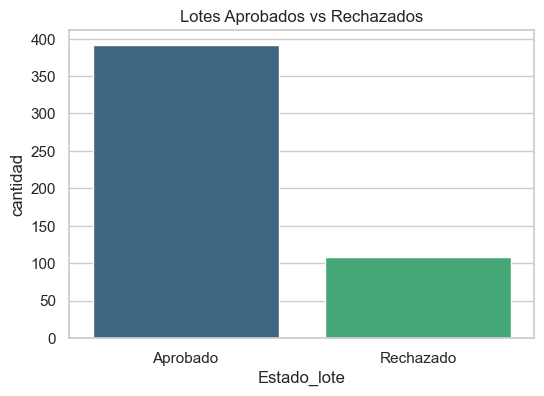
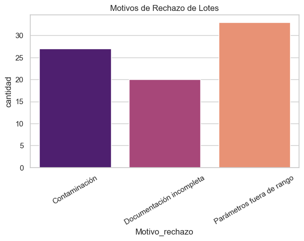
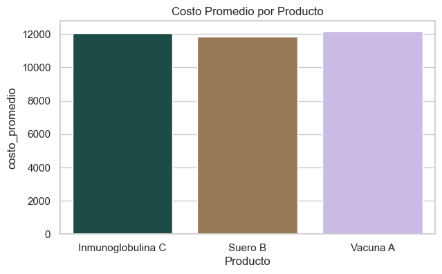
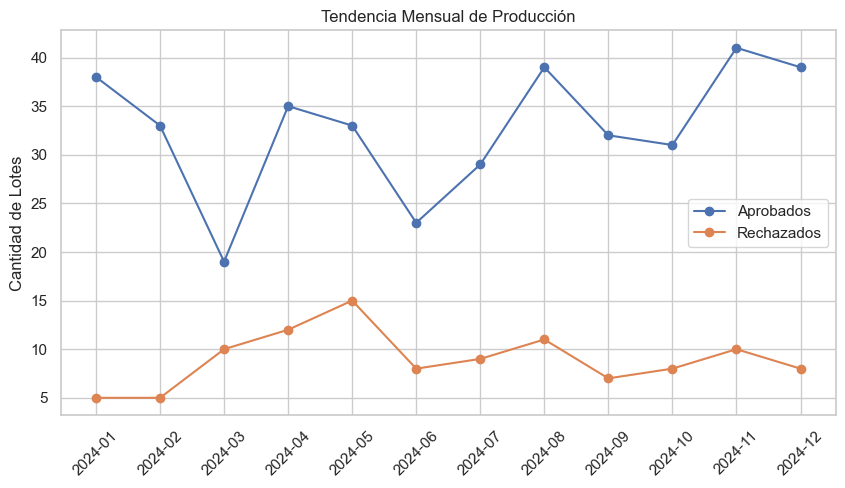

---

## 🛠️ Tecnologías utilizadas  
- **Python** (pandas, numpy, seaborn, matplotlib)  
- **SQLite** (base de datos relacional ligera)  
- **SQL** (consultas para KPIs de producción)  

---

## 📊 Variables principales del dataset  
- `Lote_ID` → Identificador del lote  
- `Producto` → Nombre del producto (Vacuna A, Suero B, Inmunoglobulina C)  
- `Fecha_produccion` → Fecha de elaboración  
- `Tiempo_ciclo_horas` → Tiempo del ciclo productivo  
- `Temperatura_media` → Temperatura media registrada  
- `Humedad_media` → Humedad media registrada  
- `Estado_lote` → Aprobado / Rechazado  
- `Motivo_rechazo` → Causa del rechazo (si aplica)  
- `Costo_produccion_USD` → Costo estimado por lote  
- `Fecha_vencimiento` → Fecha de caducidad  

---

## 📈 Consultas SQL realizadas  
- Total de lotes aprobados vs rechazados.  
- % de rendimiento de producción.  
- Motivos más frecuentes de rechazo.  
- Costo promedio por producto.  
- Tendencia mensual de producción.  

---

## 📊 Visualizaciones en Python  
1. **Lotes aprobados vs rechazados**  
     

2. **Motivos de rechazo**  
     

3. **Costo promedio por producto**  
     

4. **Tendencia mensual de producción**  
     

---

## 🚀 Resultados e Insights  
- El **80% de los lotes** fueron aprobados, mientras que el 20% fueron rechazados.  
- El principal motivo de rechazo fue **contaminación**, seguido de parámetros fuera de rango.  
- El producto con mayor costo promedio fue **Inmunoglobulina C**.  
- Se detectaron **meses con mayor concentración de rechazos**, lo que puede indicar problemas puntuales en la producción.  

---

## 📌 Cómo ejecutar el proyecto  
1. Clonar el repositorio:  
   ```bash
   git clone https://github.com/tuusuario/proyecto_farmaceutico.git

